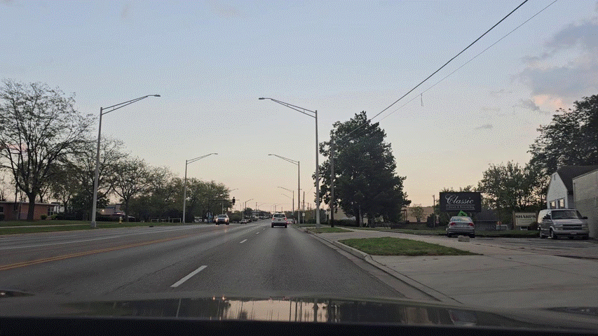

# ADCD: Adverse Driving Conditions Dataset
 
A synthetic benchmark for evaluating object detection models under 12 adverse weather conditions. Companion dataset for *"Towards safer roads: benchmarking object detection models in complex weather scenarios"* (Machine Vision and Applications, 2025).
 
## Overview
 
ADCD combines five source subsets (Udacity, ApolloScape, IDD, A2D2, and the newly collected Dayton Driving Dataset) into a clear-weather base set, then augments it with **8 single** and **4 mixed** weather effects - **50,000 images per effect**.
 
Annotations cover six transportation classes: `car`, `truck`, `bicycle`, `motorcycle`, `person`, `traffic_light`. Object positions are preserved across all effects, so ground-truth labels from the base set transfer directly to every augmented version (no re-annotation needed).
 
| Subset      | Location              | Year | Images |
|-------------|-----------------------|------|--------|
| Udacity     | Mountain View, USA    | 2016 | 24,007 |
| ApolloScape | China                 | 2018 | 7,040  |
| IDD         | India                 | 2019 | 5,713  |
| A2D2        | Germany               | 2020 | 12,469 |
| DDD         | Dayton, USA           | 2024 | 755    |

## Weather effects


 
**Single (8):** crack, flare, haze, raindrop, snow, sunset, night, rain

**Mixed (4):** haze+raindrop, haze+night, rain+raindrop, crack+flare
 
Each single effect links either to its source repo (public method) or to a subfolder in this repo (our own method):
 
| Effect(s)     | Code   |
|---------------|--------|
| crack         | [`./crack`](./crack) |
| flare         | [`./flare`](./flare) |
| haze          | [`./haze`](./haze) |
| raindrop      | [`./raindrop`](./raindrop) |
| snow, sunset  | [InstructPix2Pix](https://github.com/timothybrooks/instruct-pix2pix) - prompts `"Make it winter"` / `"Make it sunset"` |
| rain, night   | [CycleGAN-Turbo](https://github.com/GaParmar/img2img-turbo) |
 
Mixed effects are produced by running the two corresponding single effects in sequence (e.g. haze+raindrop = haze, then raindrop).

## Data access
 
The data is distributed as zip archives on [Google Drive](https://drive.google.com/drive/folders/1uBxd6ehZdCGj0MA4c2jVwpTWjwyl24lc?usp=sharing), including:
 
- **Base dataset**: clear-weather images.
- **Labels**: YOLO-format annotations, shared across the base set and every effect.
- **Image-name index**: mapping of each image to its source subset (Udacity / ApolloScape / IDD / A2D2 / DDD).
- **Per-effect sets**: one zip per single and mixed effect (12 total).

## Evaluation
 
Models were evaluated using their **publicly released pretrained weights** (no fine-tuning) at IoU ≥ 0.5 and confidence ≥ 0.25, reporting per-class AP and mAP (all-point interpolation). Evaluated detectors: YOLOv5–v11, DETR, R-CNN, Faster R-CNN, RetinaNet, SSD.


## Citation
 
```bibtex
@article{tran2025towards,
  title={Towards safer roads: benchmarking object detection models in complex weather scenarios},
  author={Tran-Le, Ba-Thinh and Patel, Vatsa and Huynh, Viet-Tham and Tran, Mai-Khiem and Agrawal, Kunal and Tran, Minh-Triet and Nguyen, Tam V},
  journal={Machine Vision and Applications},
  volume={36},
  number={4},
  pages={94},
  year={2025},
  publisher={Springer}
}
```
 
## Acknowledgements
 
This research was supported by the National Science Foundation (NSF) under Grant 2025234.
 
